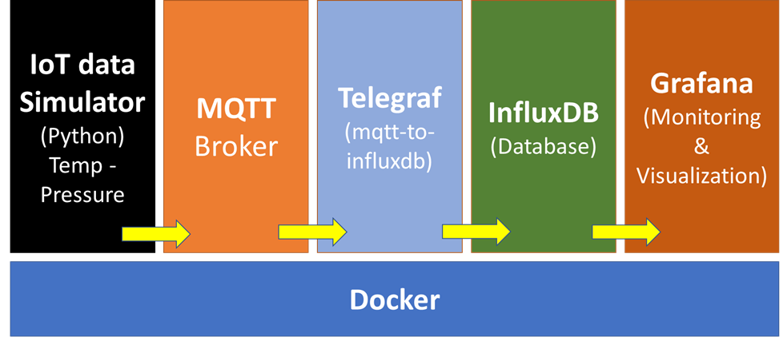

# IoT Monitoring and Visualization System

This repository contains a collection of Dockerized services and scripts to simulate, collect, store, and visualize IoT data. The architecture includes an MQTT broker, an InfluxDB database, Telegraf for data ingestion, Grafana for visualization, and a Python-based IoT simulator.




## Final Outcome

✅ IoT Simulator generates data → ✅ MQTT distributes it → ✅ Telegraf processes it → ✅ InfluxDB stores it → ✅ Grafana visualizes it 🚀

## Table of Contents
- [Overview](#overview)
- [Architecture](#architecture)
- [Setup](#setup)
- [Files and Descriptions](#files-and-descriptions)
- [Usage](#usage)
- [Grafana Dashboard Provisioning](#grafana-dashboard-provisioning)
- [InfluxDB Setup](#influxdb-setup)
- [Contributing](#contributing)
- [License](#license)

---

## Overview
This system simulates IoT devices using MQTT, stores the data in InfluxDB, and visualizes it in Grafana. The setup includes:
- **MQTT Broker**: For IoT device communication.
- **InfluxDB**: Time-series database for data storage.
- **Telegraf**: Intermediary for ingesting MQTT data into InfluxDB.
- **Grafana**: Visualization and monitoring platform.
- **IoT Simulator**: Python script to simulate IoT devices sending data to the MQTT broker.

---

## Architecture
The architecture consists of the following containers and services:
1. **MQTT Broker**: Based on Eclipse Mosquitto.
2. **InfluxDB**: Stores IoT data like temperature, pressure, etc.
3. **Telegraf**: Bridges MQTT and InfluxDB.
4. **Grafana**: Visualizes data using dashboards.
5. **IoT Simulator**: Python script to generate dummy IoT data.

---

## Setup
### Prerequisites
- Docker and Docker Compose installed on your machine.

### Steps
1. Clone the repository:
   ```bash
   git clone https://github.com/<your-repo>.git
   cd <your-repo>
   ```
2. Build and start the Docker containers:
   ```bash
   docker-compose up -d
   ```
3. Access Grafana at `http://localhost:3000` (default username/password: `admin/admin`).
4. Grafana is pre-configured to connect to InfluxDB using **automatic provisioning**.

---

## Files and Descriptions

### 1. `docker-compose.yml`
Defines the Docker services:
- **MQTT Broker**: Uses `eclipse-mosquitto` with ports `1883` and `9001` exposed.
- **InfluxDB**: Stores IoT data; accessible at port `8086`.
- **Telegraf**: Configured to consume MQTT data and write to InfluxDB.
- **Grafana**: Visualization platform **with pre-configured dashboards**.
- **IoT Simulator**: Python-based data simulator.

### 2. `mosquitto.conf`
Configuration file for the MQTT broker (Eclipse Mosquitto).

### 3. `telegraf.conf`
Telegraf configuration file to define MQTT input and InfluxDB output.

### 4. `iot_data_simulator_mqtt.py`
Python script to simulate IoT data:
- Publishes random sensor data (e.g., temperature, pressure) to the MQTT broker.
- Configurable sensor types and publishing frequency.

---

## Grafana Dashboard Provisioning
To ensure **Grafana dashboards are automatically set up**, provisioning is used.

1. **Preconfigured Data Source:**
   - Stored in `grafana/provisioning/datasources/influxdb.yml`
   - **Example Configuration:**
     ```yaml
     apiVersion: 1
     datasources:
       - name: InfluxDB
         type: influxdb
         access: proxy
         url: http://influxdb:8086
         database: iot_data
         isDefault: true
     ```

2. **Predefined Dashboard:**
   - **Export your existing dashboard** from Grafana.
   - Save it as `grafana/provisioning/dashboards/iot_dashboard.json`
   - Create a provisioning file:
     ```yaml
     apiVersion: 1
     providers:
       - name: 'IoT Dashboard'
         folder: ''
         type: file
         options:
           path: /etc/grafana/provisioning/dashboards/iot_dashboard.json
     ```

3. **Modify `docker-compose.yml` to Include These Files**
   ```yaml
     volumes:
       - ./influxdb.yml:/etc/grafana/provisioning/datasources/influxdb.yml
       - ./iot_dashboard.json:/etc/grafana/provisioning/dashboards/iot_dashboard.json
       - ./dashboard.yml:/etc/grafana/provisioning/dashboards/dashboard.yml
   ```

---

## InfluxDB Setup
InfluxDB is automatically **pre-configured** using environment variables.

### **1️⃣ Create the Database Automatically**
Modify the Docker configuration to **auto-create the `iot_data` database**:
```yaml
  influxdb:
    environment:
      - INFLUXDB_DB=iot_data
```

### **2️⃣ Verify Connection in Grafana**
Once the system is up, check:
1. Go to **Grafana → Configuration → Data Sources**.
2. Ensure **InfluxDB is connected**.
3. Load dashboards.

---

## Usage
1. **Start the System**:
   Use Docker Compose to start all containers:
   ```bash
   docker-compose up -d
   ```

2. **Simulate IoT Devices**:
   The `iot_data_simulator_mqtt.py` script automatically starts and pushes data to the MQTT broker.

3. **View the Data**:
   - Log in to Grafana at `http://localhost:3000`.
   - The **IoT Dashboard** will be **preloaded automatically**.

---

## Contributing
Contributions are welcome! Please fork the repository and create a pull request with your changes.

---

## License
This project is licensed under the MIT License. See the [LICENSE](LICENSE) file for details.

---

### 🚀 **Final Output**
The system is **automated**—Grafana **automatically loads dashboards**, InfluxDB **creates the necessary database**, and all services connect seamlessly.  


